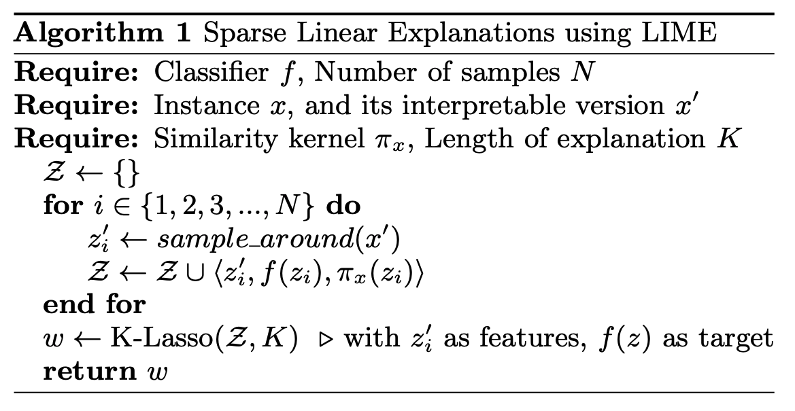
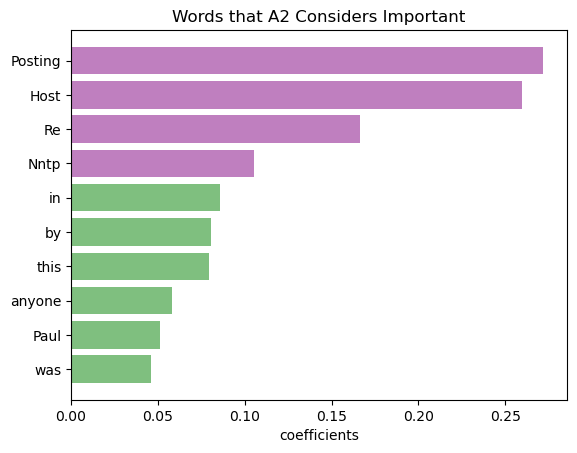

# LIME_Replication

In this project, I tried to build LIME and replicate the findings (figure 2, experiment 1 (section 5.2) & 2 (section 5.3) from the paper. I had a Random explainer as baseline, where explanations are randomly chosen from the instance as comparison for sanity check. 

Components

- Bag of Words

- Explainers
  - LIME
  - RandomExplainer

- Classifiers 
  - L1 Logistic Regression
  - L2 Logistic Regression
  - Nearest Neighbors
  - SVM

- Experiment_1 ("Section 5.2 - Are explanations faithful to the model?")

- Experiment_2 ("Section 5.3 - Should I trust this prediction?")

##Procedure for LIME

The model was first built with the bag of words model using sklearn's countVectorizer. Then I find nonzeros features from the sparse matrix generated from the vectorizer. And permuted the nonzeros features of the instance vector randomly to generate 15000 number of samples. Then I got the labels from samples using the specified classifier (LR, NN, SVM). I calculated the consine distance of those samples and weight it by the distance kernel specified in the paper. Then I used those weights and labels to perform regularization on the features to select the K number of features and fit a localized linear model on the weighted distances and labels.

## Replicating Figure 2
The results seems similar to the explanations from figure 2 with the order (by the absolute value of the coefficients) slightly off.

## Experiment 1 - Replicating the results from 5.2

Testing if the explanations are similar to a well known model (LR). Use the features from the LR model as gold label.

| Explainer     | LR        |
| ------------- |:---------:|
| Random        |         |
| LIME          |         |

Something went wrong here and we couldn't find the 

## Experiment 2 - Replicating the results from 5.3

Randomly choose 25% of the features to be untrustworthy, use these features to guage prediction changes when removed. If prediction didn't change, the features are trustworthy, if the prediction changes, the features are untrustworthy. We measure their F1 scores.

Books

| Explainer     | LR    | NN    |   SVM |
| ------------- | -----:| -----:| -----:|
| Random        |     |  |  |
| LIME          |       |    |    |

DVDs

| Explainer     | LR    | NN    |   SVM |
| ------------- | -----:| -----:| -----:|
| Random        |     |  |  |
| LIME          |       |    |    |

